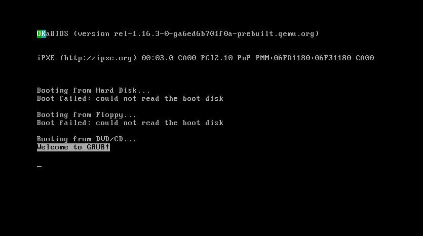

# 🍌 PazhamOS  
> A lightweight banana-flavored hobby operating system — booted from scratch with NASM, GRUB, and QEMU.




---

## 🧠 Overview

**PazhamOS** is a **bare-metal hobby operating system** designed to explore low-level systems programming, bootloaders, and kernel initialization.  
It currently boots using **GRUB (Multiboot2)** and displays a custom banana-yellow GRUB menu 🍌.

> “Because every OS deserves a little potassium.”

---

## ✨ Features (so far)

✅ Custom GRUB boot menu with PNG background  
✅ Multiple boot entries (Normal / Safe / Debug)  
✅ x86_64 Assembly kernel  
✅ Custom linker script and Makefile-based build  
✅ Bootable ISO image built via Docker  
✅ Fully runnable in QEMU  

---

## 🛠️ Build Instructions

### 1️⃣ Clone the repository
```bash
git clone git@github.com:colonelblac/PazhamOS.git
cd PazhamOS
